# Comprehensive UML Diagrams - Pump Anomaly Detection System

This document contains detailed UML diagrams for the complete Pump Anomaly Detection System (Phase 1 + Phase 2B).

---

## Table of Contents
1. [Class Diagrams](#class-diagrams)
2. [Use Case Diagrams](#use-case-diagrams)
3. [Sequence Diagrams](#sequence-diagrams)
4. [Component Diagram](#component-diagram)
5. [Deployment Diagram](#deployment-diagram)

---

## 1. Class Diagrams

### 1.1 Core Analysis Classes (Phase 1)

```plantuml
@startuml Phase1_Core_Classes

' Core Data Processing
class DataProcessor {
  - REQUIRED_BASELINE_COLS: list[str]
  - REQUIRED_OPERATIONAL_COLS: list[str]

  + load_baseline_data(filepath: str): dict
  + load_operational_data(filepath: str, well_id: str): DataFrame
  + calculate_deviations(df: DataFrame, baseline: dict, mapping: dict): DataFrame
  + validate_data(df: DataFrame, required_cols: list): void
  - _parse_timestamp(timestamp_str: str): datetime
  - _validate_positive_values(df: DataFrame): void
  - _check_efficiency_range(df: DataFrame): void
}

' Tolerance Checking
class ToleranceChecker {
  - tolerances_file: str
  - all_tolerances: dict

  + select_tolerance_category(application: str, horsepower: float): str
  + load_tolerances(category: str): dict
  + check_tolerances(deviations: Series, tolerances: dict): dict
  + classify_status(tolerance_check: dict, history: DataFrame): str
  + find_first_exceedance(df: DataFrame, tolerances: dict): dict
  - _calculate_severity(deviation: float, threshold: float): float
  - _check_bidirectional(deviation: float, max_th: float, min_th: float): bool
  - _check_positive_only(deviation: float, threshold: float): bool
  - _check_negative_only(deviation: float, threshold: float): bool
}

class ToleranceSpec {
  + mandatory: bool
  + max_deviation: float
  + min_deviation: float
  + parameter_name: str

  + is_exceeded(deviation: float): bool
  + get_severity(deviation: float): float
}

ToleranceChecker "1" *-- "many" ToleranceSpec : contains

' ML Predictive Model
class PredictiveModel {
  - model: RandomForestRegressor
  - scaler: StandardScaler
  - feature_names: list[str]
  - model_metadata: dict

  + engineer_features(df: DataFrame, window_sizes: list): DataFrame
  + create_failure_labels(df: DataFrame, failure_date: str, mode: str): Series
  + train_failure_predictor(X: DataFrame, y: Series, model_type: str): tuple
  + predict_failure(model, scaler, current_data: DataFrame): dict
  + save_model(model, scaler, output_dir: str): void
  + load_model(model_dir: str): tuple
  - _create_rolling_features(df: DataFrame, window: int): DataFrame
  - _create_trend_features(df: DataFrame): DataFrame
  - _create_interaction_features(df: DataFrame): DataFrame
}

class FeatureEngineer {
  - window_sizes: list[int]
  - parameters: list[str]

  + create_rolling_statistics(df: DataFrame): DataFrame
  + create_trend_features(df: DataFrame): DataFrame
  + create_acceleration_features(df: DataFrame): DataFrame
  + create_cumulative_features(df: DataFrame): DataFrame
  + create_temporal_features(df: DataFrame): DataFrame
  - _calculate_slope(series: Series, window: int): float
}

PredictiveModel "1" o-- "1" FeatureEngineer : uses

' Visualization
class Visualizer {
  - output_dir: str
  - dpi: int
  - figure_size: tuple

  + plot_parameter_timeseries(df: DataFrame, param: str, baseline: float, ...): void
  + plot_multi_parameter_dashboard(df: DataFrame, baseline: dict, ...): void
  + plot_degradation_timeline(first_exceedances: dict, failure_date: str, ...): void
  + plot_deviation_trends(df: DataFrame, ...): void
  + plot_status_timeline(df: DataFrame, ...): void
  - _setup_plot_style(): void
  - _add_tolerance_bands(ax: Axes, baseline: float, tolerance: float): void
  - _color_code_regions(ax: Axes, df: DataFrame, status: Series): void
}

' Main Orchestrator
class PumpMonitor {
  - baseline_file: str
  - baseline: dict
  - tolerance_category: str
  - tolerances: dict
  - operational_df: DataFrame
  - processed_df: DataFrame
  - model: object
  - scaler: object
  - model_metadata: dict

  + __init__(baseline_file: str, tolerance_category: str)
  + load_operational_data(filepath: str): void
  + analyze(train_model: bool, failure_date: str, save_processed: bool): void
  + get_current_status(): str
  + get_anomaly_timeline(): DataFrame
  + predict_failure(): dict
  + generate_report(output_path: str): void
  - _calculate_all_deviations(): void
  - _check_all_tolerances(): void
  - _train_predictive_model(failure_date: str): void
  - _generate_visualizations(): void
}

PumpMonitor "1" --> "1" DataProcessor : uses
PumpMonitor "1" --> "1" ToleranceChecker : uses
PumpMonitor "1" --> "1" PredictiveModel : uses
PumpMonitor "1" --> "1" Visualizer : uses

' Data Models
class BaselineData {
  + well_id: str
  + pump_type: str
  + horsepower: float
  + application: str
  + baseline_flow_gpm: float
  + baseline_discharge_pressure_psi: float
  + baseline_power_hp: float
  + baseline_efficiency_percent: float

  + to_dict(): dict
  + validate(): bool
}

class OperationalReading {
  + timestamp: datetime
  + well_id: str
  + flow_gpm: float
  + discharge_pressure_psi: float
  + suction_pressure_psi: float
  + motor_power_hp: float
  + pump_efficiency_percent: float
  + motor_speed_rpm: float

  + calculate_deviation(baseline: BaselineData): dict
  + to_series(): Series
}

class DeviationRecord {
  + timestamp: datetime
  + flow_deviation_pct: float
  + head_deviation_pct: float
  + power_deviation_pct: float
  + efficiency_deviation_pct: float
  + status: str
  + violations: dict

  + exceeds_tolerance(tolerances: dict): bool
  + get_severity(): float
}

PumpMonitor "1" *-- "1" BaselineData : has
PumpMonitor "1" *-- "many" OperationalReading : processes
PumpMonitor "1" *-- "many" DeviationRecord : generates

@enduml
```

**Explanation:**
- **DataProcessor**: Handles all CSV loading, timestamp parsing, and data validation
- **ToleranceChecker**: Implements the 6 tolerance categories (1B, 1E, 1U, 2B, 2U, 3B) with bidirectional/unidirectional checking
- **PredictiveModel**: Random Forest model with 64+ engineered features for RUL prediction
- **Visualizer**: Creates all plots (timeseries, dashboards, timelines, trends)
- **PumpMonitor**: Main orchestrator that coordinates all components
- **Data Models**: Value objects representing baseline, readings, and deviations

---

### 1.2 Edge Deployment Classes (Phase 2B)

```plantuml
@startuml Phase2B_Edge_Classes

' API Client
class AnomalyAPIClient {
  - base_url: str
  - bearer_token: str
  - retry_attempts: int
  - retry_delay: int
  - session: Session

  + __init__(base_url: str, bearer_token: str, retry_attempts: int, retry_delay: int)
  + submit_anomaly(anomaly_data: dict): dict
  + query_anomalies(site_id: int, pump_id: int, ...): dict
  + validate_payload(anomaly_data: dict): bool
  - _retry_with_backoff(func: callable, *args): any
  - _handle_api_error(error: Exception): void
}

class HTTPSession {
  + headers: dict
  + timeout: int

  + post(url: str, json: dict): Response
  + get(url: str, params: dict): Response
}

AnomalyAPIClient "1" o-- "1" HTTPSession : uses

' Edge Inference Engine
class EdgeInference {
  - artifact_dir: Path
  - model: object
  - scaler: object
  - model_metadata: dict
  - baseline_parameters: dict
  - tolerances: dict
  - column_mapping: dict
  - deployment_config: dict
  - tolerance_category: str
  - anomaly_client: AnomalyAPIClient
  - last_reported: dict

  + __init__(artifact_dir: str)
  + load_configs(): void
  + load_model(): void
  + setup_api_client(): void
  + process_sensor_data(input_csv: str): DataFrame
  + calculate_deviations(row: Series): dict
  + check_tolerances(deviations: dict): dict
  + extract_features(df: DataFrame): ndarray
  + predict_failure(features: ndarray): dict
  + should_report_anomaly(tolerance_results: dict, prediction: dict): tuple
  + format_anomaly_payload(tolerance_results: dict, prediction: dict, row: Series): dict
  + save_unsent_anomaly(payload: dict): void
  + run_inference(input_csv: str, output_json: str): void
  - _is_debounced(parameter: str): bool
  - _update_debounce_tracker(parameter: str): void
}

class ConfigLoader {
  - config_dir: Path

  + load_deployment_config(): dict
  + load_baseline_parameters(): dict
  + load_tolerances(): dict
  + load_column_mapping(): dict
  + validate_config(config: dict): bool
}

class ModelLoader {
  - model_dir: Path

  + load_model_file(filename: str): object
  + load_scaler(): StandardScaler
  + load_metadata(): dict
  + verify_model_compatibility(): bool
}

EdgeInference "1" --> "1" AnomalyAPIClient : uses
EdgeInference "1" o-- "1" ConfigLoader : uses
EdgeInference "1" o-- "1" ModelLoader : uses

' Debouncing Manager
class DebounceManager {
  - debounce_minutes: int
  - last_reported: dict[str, datetime]

  + is_debounced(parameter: str): bool
  + update_tracker(parameter: str): void
  + reset_tracker(parameter: str): void
  + get_elapsed_time(parameter: str): float
}

EdgeInference "1" *-- "1" DebounceManager : contains

' Artifact Packager
class ArtifactPackager {
  - pump_name: str
  - version: str
  - project_root: Path
  - model_dir: Path
  - baseline_file: str
  - baseline_data: dict

  + __init__(pump_name: str, version: str)
  + load_baseline(baseline_file: str): void
  + create_artifact_structure(temp_dir: Path): void
  + copy_model_files(temp_dir: Path): void
  + create_config_files(temp_dir: Path): void
  + copy_inference_script(temp_dir: Path): void
  + copy_api_client(temp_dir: Path): void
  + create_requirements(temp_dir: Path): void
  + create_readme(temp_dir: Path): void
  + package(output_path: str): void
  - _create_zip_archive(temp_dir: Path, output_path: str): void
}

class ArtifactBuilder {
  + add_model_files(artifact: Artifact, model_dir: Path): void
  + add_config_files(artifact: Artifact, configs: dict): void
  + add_scripts(artifact: Artifact, scripts: list): void
  + validate_artifact(artifact: Artifact): bool
}

ArtifactPackager "1" --> "1" ArtifactBuilder : uses

' Query Tool
class AnomalyQueryTool {
  - client: AnomalyAPIClient

  + __init__(base_url: str, bearer_token: str)
  + query(site_id: int, pump_id: int, start_date: str, ...): DataFrame
  + summary_stats(df: DataFrame): dict
  + export_csv(df: DataFrame, output_path: str): void
  + visualize_timeline(df: DataFrame, output_path: str): void
  + compare_pumps(df: DataFrame): void
  - _parse_api_response(response: dict): DataFrame
  - _extract_context_fields(df: DataFrame): DataFrame
}

AnomalyQueryTool "1" --> "1" AnomalyAPIClient : uses

' Payload Builder
class AnomalyPayloadBuilder {
  + build_payload(tolerance_results: dict, prediction: dict, site_info: dict): dict
  + add_context(payload: dict, deviations: dict, baseline: dict, current: dict): dict
  + add_metadata(payload: dict, model_info: dict, prediction: dict): dict
  + validate_payload(payload: dict): bool
  - _format_description(violations: dict): str
  - _select_worst_sensor(violations: dict, sensor_ids: dict): int
}

EdgeInference "1" --> "1" AnomalyPayloadBuilder : uses

' Local Storage Manager
class LocalStorageManager {
  - storage_dir: Path
  - retention_days: int

  + save_result(result: dict, timestamp: datetime): void
  + save_unsent_anomaly(anomaly: dict): void
  + load_unsent_anomalies(): list[dict]
  + cleanup_old_files(): void
  + get_storage_usage(): int
}

EdgeInference "1" *-- "1" LocalStorageManager : contains

@enduml
```

**Explanation:**
- **AnomalyAPIClient**: REST API client with retry logic and error handling
- **EdgeInference**: Main engine running on edge devices (Raspberry Pi, etc.)
- **DebounceManager**: Prevents API spam by tracking last reported time per parameter
- **ArtifactPackager**: Creates deployable ZIP files with all necessary components
- **AnomalyQueryTool**: Queries and analyzes historical anomalies from API
- **LocalStorageManager**: Handles local file storage and cleanup

---

### 1.3 Complete System Class Diagram

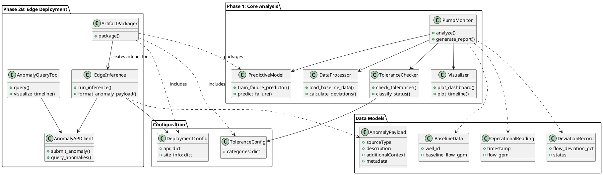

---

## 2. Use Case Diagrams

### 2.1 Phase 1: Core Analysis Use Cases

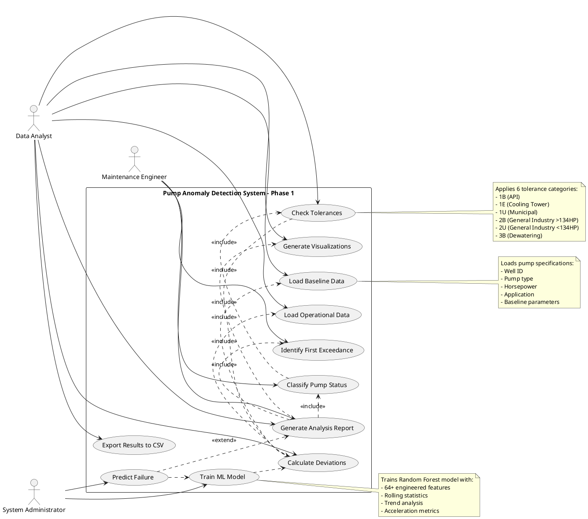

**Use Case Descriptions:**

**UC1: Load Baseline Data**
- **Actor**: Data Analyst
- **Precondition**: Baseline CSV file exists with correct format
- **Main Flow**:
  1. System reads baseline CSV
  2. Validates required columns
  3. Extracts pump specifications
  4. Determines tolerance category
- **Postcondition**: Baseline parameters loaded into memory

**UC4: Check Tolerances**
- **Actor**: System (automated)
- **Precondition**: Deviations calculated
- **Main Flow**:
  1. Load tolerance specifications for category
  2. For each parameter (Flow, Head, Power, Efficiency):
     - Check if deviation exceeds max threshold
     - Check if deviation exceeds min threshold (bidirectional only)
  3. Identify violations (mandatory vs optional)
  4. Calculate severity for each violation
- **Postcondition**: Violations identified, status classified

**UC5: Train ML Model**
- **Actor**: System Administrator
- **Precondition**: Sufficient operational data (168+ hours)
- **Main Flow**:
  1. Engineer 64+ features from sensor data
  2. Create RUL labels based on failure date
  3. Train Random Forest model
  4. Evaluate performance (MAE, RMSE, R²)
  5. Save model, scaler, feature names
- **Postcondition**: Trained model saved to disk

---

### 2.2 Phase 2B: Edge Deployment Use Cases

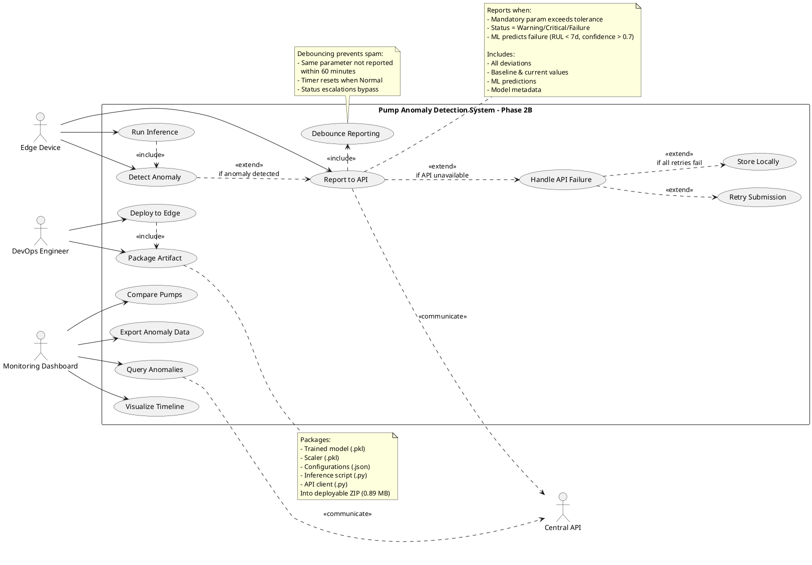

**Use Case Descriptions:**

**UC20: Package Artifact**
- **Actor**: DevOps Engineer
- **Precondition**: Model trained and validated
- **Main Flow**:
  1. Load baseline data for pump
  2. Copy trained model files
  3. Create configuration files (baseline, tolerances, deployment)
  4. Copy inference script and API client
  5. Generate deployment README
  6. Create ZIP archive
- **Postcondition**: Deployable artifact created (well1_v1.0.0.zip)

**UC22: Run Inference**
- **Actor**: Edge Device (automated, hourly cron job)
- **Precondition**: Artifact deployed, sensor data available
- **Main Flow**:
  1. Load configurations and model
  2. Read sensor data CSV
  3. Calculate deviations from baseline
  4. Check tolerance thresholds
  5. Extract features for ML
  6. Predict failure (if enough data)
  7. Determine if reporting needed
  8. Format payload
  9. Submit to API (if anomaly detected)
  10. Save results locally
- **Postcondition**: Inference complete, results saved

**UC24: Report to API**
- **Actor**: Edge Device
- **Precondition**: Anomaly detected, API client configured
- **Main Flow**:
  1. Check debounce status
  2. Format anomaly payload
  3. Validate payload
  4. Submit POST request to API
  5. Handle response
  6. Update debounce tracker
- **Alternative Flow**:
  - If API unavailable → UC30 (Handle API Failure)
  - If debounced → Skip reporting
- **Postcondition**: Anomaly reported or saved locally

**UC29: Debounce Reporting**
- **Actor**: System (automated)
- **Precondition**: Anomaly detected
- **Main Flow**:
  1. Check last reported time for parameter
  2. Calculate elapsed time
  3. If elapsed < 60 minutes → Skip reporting
  4. If elapsed >= 60 minutes → Allow reporting
  5. If status escalated → Bypass debounce
- **Postcondition**: Decision made on reporting

---

### 2.3 Complete System Use Case Diagram

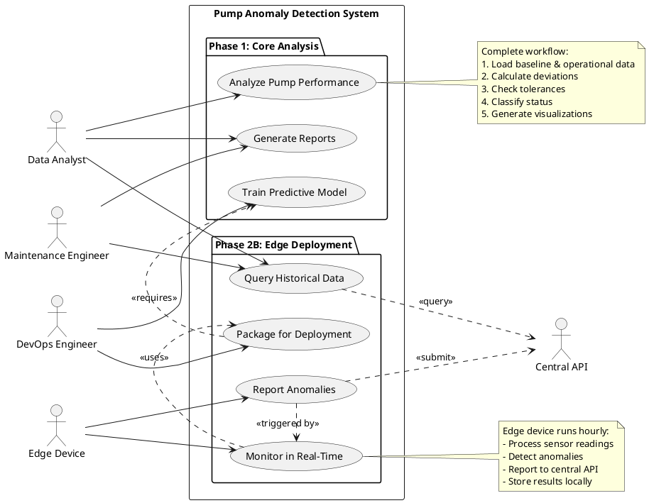

---

## 3. Sequence Diagrams

### 3.1 Phase 1: Training and Analysis Flow

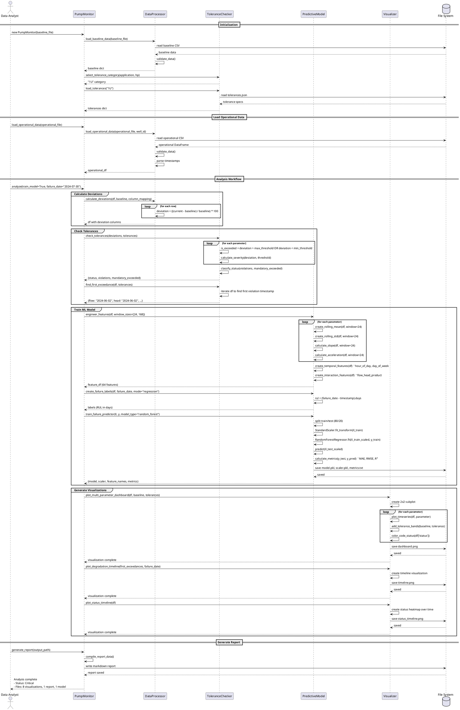

**Key Points:**
1. **Initialization**: Loads baseline, determines tolerance category (1U for Municipal)
2. **Deviation Calculation**: Compares each reading to baseline using formula: `((current - baseline) / baseline) * 100`
3. **Tolerance Checking**: Checks each parameter against thresholds, identifies mandatory violations
4. **Feature Engineering**: Creates 64 features including rolling stats (24h, 168h), trends, slopes, acceleration
5. **Model Training**: Random Forest with 100 trees, predicts RUL (Remaining Useful Life)
6. **Visualization**: Generates 8 plots (dashboard, timeline, trends, status, 4 individual parameters)
7. **Report Generation**: Markdown report with embedded visualizations

---

### 3.2 Phase 2B: Edge Inference and Reporting Flow

```plantuml
@startuml Phase2B_Inference_Sequence

participant "Cron Job" as cron
participant "EdgeInference" as inference
participant "ConfigLoader" as config
participant "ModelLoader" as loader
participant "DebounceManager" as debounce
participant "AnomalyAPIClient" as api
participant "LocalStorage" as storage
participant "Central API" as central
database "File System" as fs

== System Initialization (on startup) ==
cron -> inference: new EdgeInference(artifact_dir=".")

group Load Configurations
  inference -> config: load_deployment_config()
  config -> fs: read config/deployment_config.json
  fs --> config: {api, site_info, anomaly_reporting}
  config --> inference: deployment_config

  inference -> config: load_baseline_parameters()
  config -> fs: read config/baseline.json
  fs --> config: {baseline_flow, baseline_head, ...}
  config --> inference: baseline_parameters

  inference -> config: load_tolerances()
  config -> fs: read config/tolerances.json
  fs --> config: all tolerance categories
  config -> config: select category "1U"
  config --> inference: tolerances for 1U

  inference -> config: load_column_mapping()
  config -> fs: read config/column_mapping.json
  fs --> config: {flow: "Flow (gpm)", ...}
  config --> inference: column_mapping
end

group Load ML Model
  inference -> loader: load_model()
  loader -> fs: read model/anomaly_detector.pkl
  fs --> loader: RandomForestRegressor
  loader --> inference: model

  inference -> loader: load_scaler()
  loader -> fs: read model/scaler.pkl
  fs --> loader: StandardScaler
  loader --> inference: scaler

  inference -> loader: load_metadata()
  loader -> fs: read model/model_metadata.json
  fs --> loader: {version: "1.0.0", model_type: "random_forest"}
  loader --> inference: metadata
end

group Setup API Client
  inference -> api: new AnomalyAPIClient(base_url, bearer_token)
  api -> api: create HTTP session with auth headers
  api --> inference: client ready
end

inference -> debounce: new DebounceManager(debounce_minutes=60)
debounce --> inference: debounce manager ready

== Hourly Inference Run ==
cron -> inference: run_inference("sensor_data.csv", "results.json")

group Process Sensor Data
  inference -> fs: read sensor_data.csv
  fs --> inference: DataFrame with 3 readings
  inference -> inference: parse timestamps
  inference -> inference: sort by timestamp
  inference -> inference: select latest row (current_row)
end

group Calculate Deviations
  loop for each parameter (flow, head, power, efficiency)
    inference -> inference: col = column_mapping[param]
    inference -> inference: baseline = baseline_parameters[f"baseline_{param}"]
    inference -> inference: current = current_row[col]
    inference -> inference: deviation = ((current - baseline) / baseline) * 100
  end
  inference --> inference: deviations = {flow: 15.0, head: 10.0, power: 8.5, efficiency: -1.2}
end

group Check Tolerances
  loop for each parameter
    inference -> inference: max_threshold = tolerances[param]["max_deviation"]
    inference -> inference: min_threshold = tolerances[param]["min_deviation"]

    alt deviation > max_threshold
      inference -> inference: violations[param] = {exceeded: true, type: "max"}
    else deviation < min_threshold AND min_threshold > -999
      inference -> inference: violations[param] = {exceeded: true, type: "min"}
    end
  end

  inference -> inference: classify_status(violations, mandatory_exceeded)

  alt mandatory_exceeded AND severity > 2.0
    inference -> inference: status = "Failure"
  else mandatory_exceeded AND severity > 1.5
    inference -> inference: status = "Critical"
  else mandatory_exceeded
    inference -> inference: status = "Warning"
  else only optional violations
    inference -> inference: status = "Warning"
  else no violations
    inference -> inference: status = "Normal"
  end

  inference --> inference: tolerance_results = {status: "Warning", violations: {...}}
end

group ML Prediction (if enough data)
  alt DataFrame has >= 168 rows
    inference -> inference: extract_features(df)
    inference -> inference: create rolling statistics (24h, 168h)
    inference -> inference: calculate slopes and acceleration
    inference -> inference: features = [64 feature values]
    inference -> inference: features_scaled = scaler.transform(features)
    inference -> inference: rul_prediction = model.predict(features_scaled)
    inference -> inference: rul_days = max(0, rul_prediction[0])
    inference -> inference: calculate confidence and probability
    inference --> inference: prediction = {rul_days: 12.5, probability: 0.85, confidence: 0.87}
  else
    inference --> inference: prediction = None (not enough data)
  end
end

group Determine if Reporting Needed
  inference -> inference: should_report_anomaly(tolerance_results, prediction)

  alt status == "Normal"
    inference --> inference: (False, "Status is Normal")
  else
    inference -> debounce: is_debounced(parameter)
    debounce -> debounce: elapsed = now - last_reported[parameter]

    alt elapsed < 60 minutes
      debounce --> inference: True
      inference --> inference: (False, "Recently reported")
    else
      debounce --> inference: False

      alt mandatory_exceeded
        inference --> inference: (True, "Mandatory parameter exceeded")
      else status in ["Critical", "Failure"]
        inference --> inference: (True, f"Status is {status}")
      else prediction.probability > 0.7 AND prediction.rul_days < 7
        inference --> inference: (True, "High confidence failure prediction")
      else status == "Warning"
        inference --> inference: (True, "Warning status")
      end
    end
  end
end

group Report Anomaly (if should_report = True)
  inference -> inference: format_anomaly_payload(tolerance_results, prediction, current_row)

  inference -> inference: build description
  inference -> inference: description = "Flow exceeded 15.0% (threshold: 10.0%), Head exceeded 10.0% (threshold: 6.0%)"

  inference -> inference: create payload
  note right
    {
      "sourceType": "log",
      "description": "Flow exceeded 15.0%...",
      "siteId": 35482,
      "pumpId": 1,
      "sensorId": 101,
      "timestamp": "2024-07-25T14:32:00Z",
      "logValue": 575.0,
      "additionalContext": {
        "status": "Warning",
        "all_deviations": {...},
        "baseline_values": {...},
        "current_values": {...}
      },
      "metadata": {
        "modelVersion": "1.0.0",
        "confidence": 0.87,
        "prediction_rul_days": 12.5
      }
    }
  end note

  inference -> api: submit_anomaly(payload)

  group Retry Logic with Exponential Backoff
    loop attempt = 1 to 3
      api -> api: validate_payload(payload)

      api -> central: POST /edge/anomalies\nAuthorization: Bearer TOKEN

      alt API Success (200 OK)
        central --> api: {id: 12345, ...payload, createdAt: "..."}
        api --> inference: response

        inference -> debounce: update_tracker(parameter)
        debounce -> debounce: last_reported[parameter] = now
        debounce --> inference: updated

        inference -> inference: log success

        leave
      else API Error (401, 500, timeout)
        central --> api: error response

        alt attempt < 3
          api -> api: delay = retry_delay * (2 ^ attempt)  ' exponential backoff
          api -> api: sleep(delay)
        else attempt == 3
          api -> api: log all retries failed
          api --> inference: raise Exception("All retries failed")

          inference -> storage: save_unsent_anomaly(payload)
          storage -> fs: write unsent_anomalies/anomaly_20240725_143200.json
          fs --> storage: saved
          storage --> inference: saved for retry later
        end
      end
    end
  end
end

group Save Results Locally
  inference -> inference: compile results
  note right
    {
      "timestamp": "2024-07-25T14:32:00",
      "status": "Warning",
      "deviations": {...},
      "violations": {...},
      "prediction": {...},
      "reported_to_api": true
    }
  end note

  inference -> storage: save_result(results)
  storage -> fs: write results.json
  fs --> storage: saved
  storage --> inference: saved
end

inference --> cron: Inference complete\nStatus: Warning\nReported: Yes

@enduml
```

**Key Points:**
1. **Initialization**: Loads configs, model, and sets up API client (happens once at startup)
2. **Hourly Execution**: Cron job triggers inference every hour
3. **Deviation Calculation**: Same formula as Phase 1
4. **Tolerance Checking**: Applies 1U thresholds (Flow +10%, Head +6%)
5. **ML Prediction**: Only if >=168 data points available
6. **Reporting Decision**: Multi-criteria check (mandatory violations, status, ML prediction, debounce)
7. **API Submission**: POST with retry logic (3 attempts, exponential backoff)
8. **Graceful Degradation**: If API fails, saves locally for later retry
9. **Debouncing**: Prevents reporting same parameter within 60 minutes

---

### 3.3 Artifact Packaging Sequence

```plantuml
@startuml Artifact_Packaging_Sequence

actor "DevOps Engineer" as devops
participant "CLI" as cli
participant "ArtifactPackager" as packager
participant "DataProcessor" as processor
participant "ToleranceChecker" as tolerance
database "File System" as fs
participant "ZipFile" as zip

== Command Line Invocation ==
devops -> cli: python tools/package_artifact.py\n--pump "Well 1"\n--baseline well1_baseline.csv\n--output well1_v1.0.0.zip\n--version 1.0.0

cli -> packager: new ArtifactPackager("Well 1", "1.0.0")
packager -> packager: project_root = Path(__file__).parent.parent
packager -> packager: model_dir = project_root / "models/trained_models/Well 1"
packager --> cli: packager initialized

== Load Baseline ==
cli -> packager: load_baseline(baseline_file)
packager -> processor: load_baseline_data(baseline_file)
processor -> fs: read well1_baseline.csv
fs --> processor: baseline data
processor --> packager: baseline_data dict
packager -> packager: self.baseline_data = baseline_data
packager --> cli: baseline loaded

== Package Artifact ==
cli -> packager: package(output_path="artifacts/well1_v1.0.0.zip")

group Create Temporary Directory
  packager -> fs: mkdir temp_artifact/
  fs --> packager: created
end

group Create Artifact Structure
  packager -> fs: mkdir temp_artifact/model/
  packager -> fs: mkdir temp_artifact/config/
  fs --> packager: directories created
end

group Copy Model Files
  packager -> fs: check if random_forest_model.pkl exists
  fs --> packager: exists
  packager -> fs: copy random_forest_model.pkl → temp_artifact/model/anomaly_detector.pkl
  fs --> packager: copied (3.3 MB)

  packager -> fs: copy scaler.pkl → temp_artifact/model/scaler.pkl
  fs --> packager: copied (4.2 KB)

  packager -> packager: create model_metadata.json
  note right
    {
      "version": "1.0.0",
      "pump_name": "Well 1",
      "created_at": "2024-11-19T12:38:00Z",
      "model_type": "random_forest",
      "framework": "sklearn"
    }
  end note
  packager -> fs: write temp_artifact/model/model_metadata.json
  fs --> packager: written
end

group Create Configuration Files
  packager -> packager: create baseline.json
  packager -> tolerance: select_tolerance_category(application, horsepower)
  tolerance --> packager: "1U"
  note right
    {
      "well_id": "Well 1",
      "pump_type": "Unknown - 4 Line Pump",
      "horsepower": 24.0,
      "application": "Municipal Water and Wastewater",
      "tolerance_category": "1U",
      "baseline_flow": 253.0,
      "baseline_head": 75.31,
      "baseline_power": 20.04,
      "baseline_efficiency": 60.0
    }
  end note
  packager -> fs: write temp_artifact/config/baseline.json
  fs --> packager: written

  packager -> fs: copy config/tolerances.json → temp_artifact/config/
  fs --> packager: copied (7.7 KB)

  packager -> packager: create column_mapping.json
  note right
    {
      "flow": "Flow (gpm)",
      "head": "Discharge Pressure (psi)",
      "power": "Motor Power (hp)",
      "efficiency": "Pump Efficiency (%)"
    }
  end note
  packager -> fs: write temp_artifact/config/column_mapping.json
  fs --> packager: written

  packager -> fs: copy config/deployment_config.json → temp_artifact/config/
  fs --> packager: copied (665 B)
end

group Copy Scripts
  packager -> fs: copy src/templates/inference_template.py → temp_artifact/inference.py
  fs --> packager: copied (22.6 KB)

  packager -> fs: copy src/anomaly_client.py → temp_artifact/anomaly_client.py
  fs --> packager: copied (10.3 KB)
end

group Create Requirements File
  packager -> packager: create minimal requirements list
  note right
    # Edge Inference Dependencies
    pandas>=1.3.0
    numpy>=1.21.0
    scikit-learn>=1.0.0
    joblib>=1.0.0
    requests>=2.28.0
    python-dateutil>=2.8.0
  end note
  packager -> fs: write temp_artifact/requirements.txt
  fs --> packager: written
end

group Create Deployment README
  packager -> packager: generate README content
  note right
    Includes:
    - Quick start instructions
    - Configuration guide
    - Input/output formats
    - Artifact structure
    - Troubleshooting
    - Tolerance specifications
  end note
  packager -> fs: write temp_artifact/README.md
  fs --> packager: written (2.9 KB)
end

group Create ZIP Archive
  packager -> fs: mkdir artifacts/
  fs --> packager: created

  packager -> zip: new ZipFile("artifacts/well1_v1.0.0.zip", mode='w', compression=ZIP_DEFLATED)
  zip --> packager: zip file created

  loop for each file in temp_artifact/
    packager -> zip: add_file(file, arcname=relative_path)
    zip -> fs: compress and write
    fs --> zip: written
  end

  packager -> zip: close()
  zip --> packager: ZIP complete
end

group Cleanup
  packager -> fs: calculate file size
  fs --> packager: 0.89 MB

  packager -> fs: remove temp_artifact/
  fs --> packager: cleaned up
end

packager --> cli: Artifact packaged successfully\nOutput: artifacts/well1_v1.0.0.zip\nSize: 0.89 MB

cli --> devops: ✓ ARTIFACT PACKAGED SUCCESSFULLY\n\nContents:\n- Model (3.3 MB)\n- Scaler (4.2 KB)\n- 4 config files\n- 2 Python scripts\n- Requirements\n- README

@enduml
```

**Artifact Contents:**
```
well1_v1.0.0.zip (0.89 MB)
├── model/
│   ├── anomaly_detector.pkl (3.3 MB) - Random Forest model
│   ├── scaler.pkl (4.2 KB) - StandardScaler
│   └── model_metadata.json (379 B)
├── config/
│   ├── baseline.json (291 B) - Baseline parameters
│   ├── tolerances.json (7.7 KB) - All 6 tolerance categories
│   ├── column_mapping.json (134 B) - CSV column mapping
│   └── deployment_config.json (665 B) - API credentials template
├── inference.py (22.6 KB) - Main inference script
├── anomaly_client.py (10.3 KB) - API client
├── requirements.txt (131 B) - Python dependencies
└── README.md (2.9 KB) - Deployment instructions
```

---

### 3.4 Query Anomalies Sequence

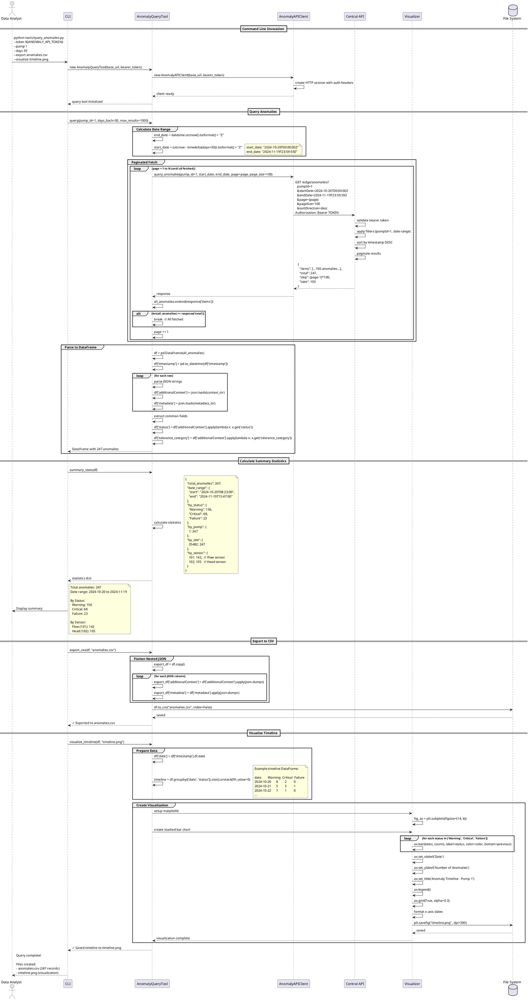

**Output Files:**

**anomalies.csv** (excerpt):
```csv
id,sourceType,description,siteId,pumpId,sensorId,timestamp,logValue,additionalContext,metadata,createdAt
12345,log,"Flow exceeded 15.0%",35482,1,101,2024-11-19T14:32:00Z,575.0,"{""status"": ""Warning"", ...}","{""modelVersion"": ""1.0.0"", ...}",2024-11-19T14:32:05Z
12346,log,"Head exceeded 10.0%",35482,1,102,2024-11-19T15:32:00Z,165.0,"{""status"": ""Warning"", ...}","{""modelVersion"": ""1.0.0"", ...}",2024-11-19T15:32:03Z
...
```

**timeline.png**: Stacked bar chart showing anomaly counts by status over time

---

## 4. Component Diagram

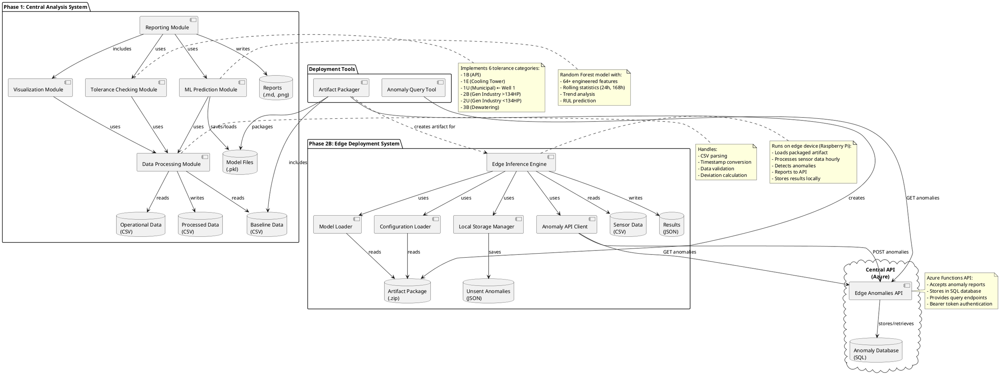

**Component Descriptions:**

1. **Data Processing Module**: Core CSV handling, timestamp parsing, deviation calculation
2. **Tolerance Checking Module**: Implements 6 tolerance categories with bidirectional/unidirectional thresholds
3. **ML Prediction Module**: Feature engineering, Random Forest training/prediction, model persistence
4. **Visualization Module**: Matplotlib-based plotting (timeseries, dashboards, timelines)
5. **Reporting Module**: Markdown report generation with embedded visualizations
6. **Edge Inference Engine**: Standalone engine running on edge devices
7. **Anomaly API Client**: REST client for submitting/querying anomalies
8. **Artifact Packager**: Creates deployable ZIP packages
9. **Anomaly Query Tool**: CLI tool for analyzing reported anomalies

---

## 5. Deployment Diagram

```plantuml
@startuml Deployment_Diagram

node "Central Analysis Server" {
  artifact "Python 3.8+" as Python1
  artifact "Phase 1 Code\n(src/)" as Phase1Code

  component "PumpMonitor" as Monitor
  component "DataProcessor" as Processor
  component "ToleranceChecker" as Tolerance
  component "PredictiveModel" as Model
  component "Visualizer" as Viz

  folder "Data Storage" {
    database "Baseline CSVs" as BaselineCSV
    database "Operational CSVs" as OperationalCSV
    database "Processed CSVs" as ProcessedCSV
  }

  folder "Model Storage" {
    database "Trained Models\n(.pkl files)" as ModelFiles
    database "Scalers\n(.pkl files)" as ScalerFiles
    database "Metrics\n(.txt files)" as MetricsFiles
  }

  folder "Output Storage" {
    database "Reports\n(.md files)" as Reports
    database "Visualizations\n(.png files)" as Visualizations
  }

  Monitor --> Processor
  Monitor --> Tolerance
  Monitor --> Model
  Monitor --> Viz

  Processor --> BaselineCSV
  Processor --> OperationalCSV
  Processor --> ProcessedCSV
  Model --> ModelFiles
  Model --> ScalerFiles
  Viz --> Visualizations
  Monitor --> Reports
}

node "DevOps Workstation" {
  artifact "Python 3.8+" as Python2
  artifact "Packaging Tools\n(tools/)" as PackagingTools

  component "ArtifactPackager" as Packager

  Packager --> ModelFiles : reads
  Packager --> BaselineCSV : reads
}

artifact "Deployable Artifact\nwell1_v1.0.0.zip\n(0.89 MB)" as Artifact {
  file "model/\n- anomaly_detector.pkl\n- scaler.pkl\n- metadata.json" as ModelArtifact
  file "config/\n- baseline.json\n- tolerances.json\n- deployment_config.json" as ConfigArtifact
  file "inference.py\nanomal y_client.py\nrequirements.txt\nREADME.md" as ScriptArtifact
}

Packager --> Artifact : creates

node "Edge Device 1\n(Raspberry Pi 4)" as Edge1 {
  artifact "Python 3.8+" as Python3
  artifact "Edge Code\n(inference.py)" as EdgeCode1

  component "EdgeInference" as Inference1
  component "AnomalyAPIClient" as APIClient1
  component "DebounceManager" as Debounce1
  component "LocalStorage" as Storage1

  folder "Sensor Data" {
    database "sensor_data.csv\n(hourly updates)" as Sensor1
  }

  folder "Local Results" {
    database "results.json" as Results1
    database "unsent_anomalies/" as Unsent1
  }

  Inference1 --> APIClient1
  Inference1 --> Debounce1
  Inference1 --> Storage1
  Inference1 --> Sensor1 : reads
  Storage1 --> Results1 : writes
  Storage1 --> Unsent1 : writes
}

node "Edge Device 2\n(Raspberry Pi 4)" as Edge2 {
  artifact "Python 3.8+" as Python4
  artifact "Edge Code\n(inference.py)" as EdgeCode2

  component "EdgeInference" as Inference2
  component "AnomalyAPIClient" as APIClient2

  folder "Sensor Data" {
    database "sensor_data.csv" as Sensor2
  }

  Inference2 --> APIClient2
  Inference2 --> Sensor2 : reads
}

node "Edge Device N\n(Raspberry Pi 4)" as EdgeN {
  artifact "..." as DotDotDot
}

cloud "Azure Cloud" {
  node "API Server\n(Azure Functions)" {
    component "Edge Anomalies API" as API
    component "Authentication\n(Bearer Token)" as Auth

    API --> Auth : uses
  }

  node "Database Server\n(Azure SQL)" {
    database "Anomalies Table" as AnomalyDB
    database "Pumps Table" as PumpsDB
    database "Sites Table" as SitesDB

    API --> AnomalyDB : stores/retrieves
    API --> PumpsDB : references
    API --> SitesDB : references
  }
}

node "Monitoring Dashboard\n(Web App)" as Dashboard {
  component "Dashboard UI" as DashboardUI
  component "AnomalyQueryTool" as QueryTool

  DashboardUI --> QueryTool
}

' Deployment Connections
Artifact ..> Edge1 : deployed to
Artifact ..> Edge2 : deployed to
Artifact ..> EdgeN : deployed to

' API Communication
APIClient1 --> API : HTTPS\nPOST /edge/anomalies\nGET /edge/anomalies
APIClient2 --> API : HTTPS
QueryTool --> API : HTTPS

' Network
package "Internet / VPN" {
}

Edge1 --> "Internet / VPN"
Edge2 --> "Internet / VPN"
EdgeN --> "Internet / VPN"
"Internet / VPN" --> API
Dashboard --> "Internet / VPN"

note right of Edge1
  Cron Job: Runs hourly
  0 * * * * cd /opt/pump-monitor && \
    python inference.py \
    /data/sensor_data.csv \
    /data/results.json
end note

note right of API
  Endpoint:
  https://sp-api-sink.azurewebsites.net
  /api/v1/edge/anomalies

  Authentication:
  Bearer Token (Edge AI API)

  Rate Limiting:
  1000 requests/hour per token
end note

note bottom of Artifact
  Package includes everything needed:
  ✓ Trained ML model (3.3 MB)
  ✓ Feature scaler
  ✓ Configuration files
  ✓ Inference scripts
  ✓ API client
  ✓ Dependencies list
  ✓ Deployment README

  Size: 0.89 MB compressed
end note

@enduml
```

**Deployment Architecture:**

1. **Central Analysis Server**: Trains models, analyzes historical data, generates reports
2. **DevOps Workstation**: Packages models into deployable artifacts
3. **Edge Devices** (1 to N): Raspberry Pi 4 units deployed at pump sites
   - Run inference hourly (cron job)
   - Report anomalies to central API
   - Store results locally
4. **Azure Cloud**:
   - API Server (Azure Functions)
   - SQL Database (Azure SQL)
5. **Monitoring Dashboard**: Web application for querying and visualizing anomalies

**Network Flow:**
- Edge devices → Internet/VPN → Azure API (HTTPS, Bearer auth)
- Dashboard → Internet/VPN → Azure API (HTTPS, Bearer auth)
- DevOps → Edge devices (SSH for artifact deployment)

---

## Summary

This UML documentation provides:

### ✅ **Class Diagrams**
- **Phase 1**: 15 classes (PumpMonitor, DataProcessor, ToleranceChecker, PredictiveModel, Visualizer, data models)
- **Phase 2B**: 10 classes (EdgeInference, AnomalyAPIClient, ArtifactPackager, DebounceManager, etc.)
- Complete system diagram showing relationships

### ✅ **Use Case Diagrams**
- **Phase 1**: 11 use cases (load data, calculate deviations, train model, generate reports)
- **Phase 2B**: 13 use cases (package artifact, run inference, report anomalies, query data)
- Actor interactions (Data Analyst, DevOps Engineer, Edge Device, Monitoring Dashboard)

### ✅ **Sequence Diagrams**
- **Training Flow**: Complete workflow from data loading to report generation
- **Edge Inference Flow**: Hourly inference, anomaly detection, API reporting with retry logic
- **Packaging Flow**: Artifact creation with all components
- **Query Flow**: Anomaly retrieval, CSV export, timeline visualization

### ✅ **Component Diagram**
- 9 major components
- Data flow between components
- Phase 1 and Phase 2B integration

### ✅ **Deployment Diagram**
- Central server architecture
- Edge device deployment (Raspberry Pi)
- Azure cloud infrastructure
- Network topology with VPN

All diagrams are in PlantUML format and can be rendered using any PlantUML renderer (online, VS Code plugin, IntelliJ, etc.).
