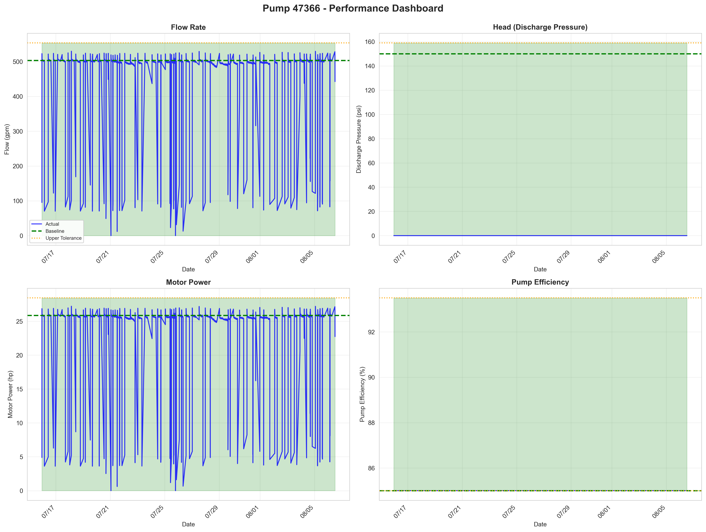
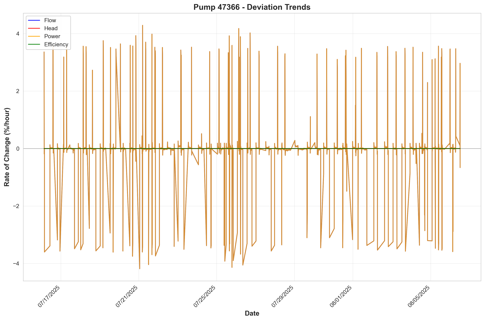
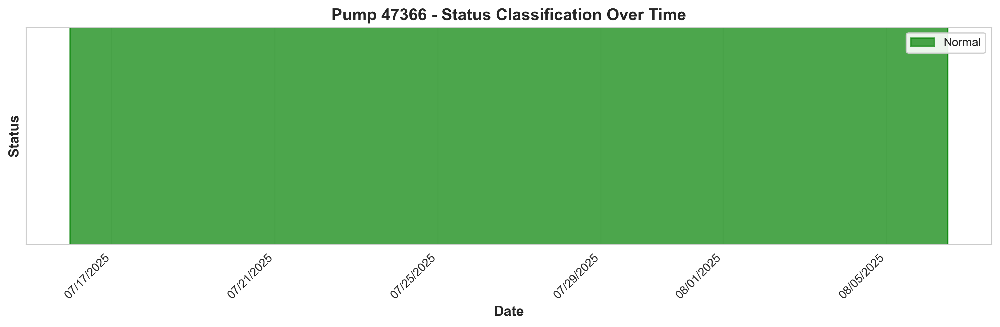

# Pump Failure Analysis Report: Pump 47366

**Generated:** 2025-11-18 11:25:37

---

## Executive Summary

This report presents a comprehensive analysis of Pump 47366, a Unknown pump rated at 100.0 HP in Municipal Water and Wastewater service.

**Tolerance Category:** 1U

**Current Status:** Normal

## Timeline of Events

### First Tolerance Exceedances

*No tolerance exceedances detected in the operational data.*

### Status Distribution

| Status | Count | Percentage |
|--------|-------|------------|
| Normal | 2050 | 100.0% |
| Warning | 0 | 0.0% |
| Critical | 0 | 0.0% |
| Failure | 0 | 0.0% |

**Analysis Period:** 2025-07-15 to 2025-08-06 (21 days)

## Visualizations

## Predictive Analysis

### ML Model Performance

A machine learning model was trained to predict pump failures.

*Model metrics are available in `models/trained_models/Pump 47366/metrics.txt`*

## Recommendations

### 1. Monitoring Frequency
- **Current Status:** Normal - Monitor **daily**
- Continue routine monitoring

### 2. Early Warning Thresholds
Set alerts at 50% of tolerance limits to enable earlier intervention:

- **Flow** (Mandatory): Alert at +5.0%
- **Head** (Mandatory): Alert at +3.0%

### 3. Maintenance Actions
Based on current status:

- Continue scheduled maintenance
- No immediate action required

### 4. Data Collection
To improve future predictions:

- Continue collecting all sensor data
- Document all maintenance activities
- Record environmental conditions (temperature, etc.)
- Track failure modes when they occur

## Conclusion

This analysis of Pump 47366 provides insights into pump performance and degradation patterns. Continue monitoring and follow the recommendations above to optimize pump reliability.

---

*Report generated by Pump Anomaly Detection System v1.0*
