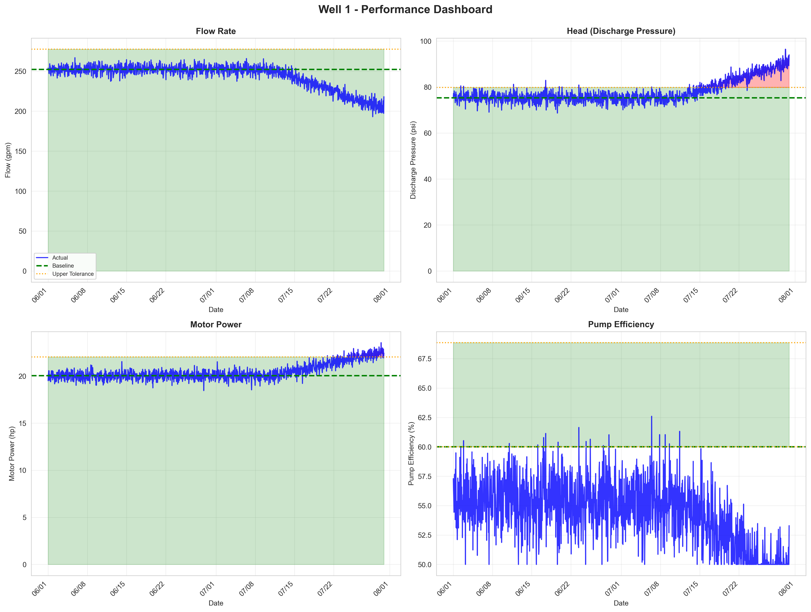
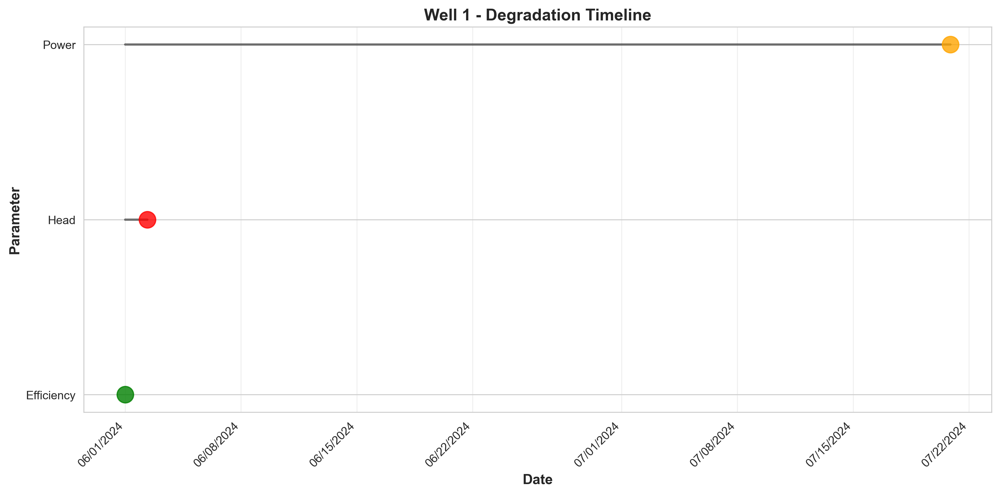
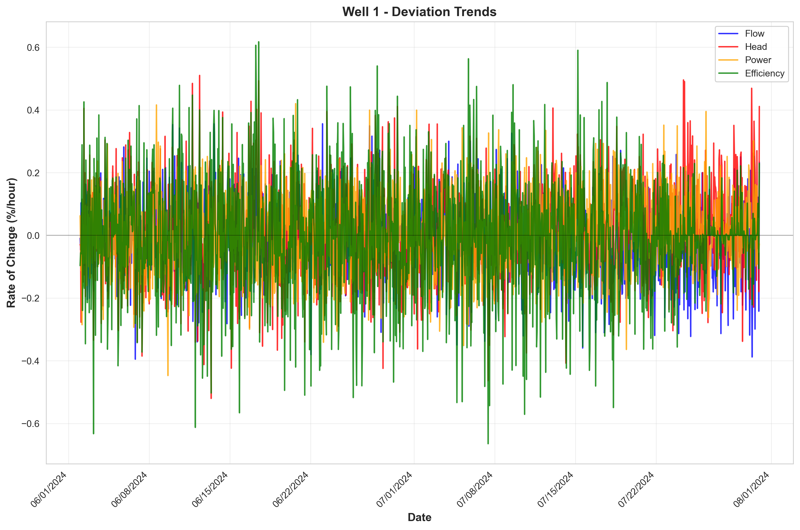
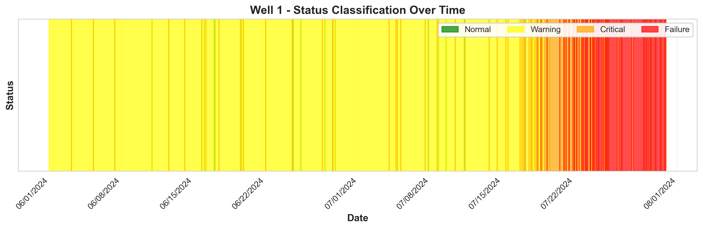

# Pump Failure Analysis Report: Well 1

**Generated:** 2025-11-18 11:31:51

---

## Executive Summary

This report presents a comprehensive analysis of Well 1, a Unknown - 4 Line Pump pump rated at 24.0 HP in Municipal Water and Wastewater service.

**Tolerance Category:** 1U

**Current Status:** Critical

## Timeline of Events

### First Tolerance Exceedances

**Head:**
- First exceeded on: 2024-06-02 08:00:00
- Baseline: 75.31
- Threshold: +6%
- Deviation at first exceedance: +6.92%

**Power:**
- First exceeded on: 2024-07-20 21:00:00
- Baseline: 20.04
- Threshold: +10%
- Deviation at first exceedance: +10.66%

**Efficiency:**
- First exceeded on: 2024-06-01 00:00:00
- Baseline: 60.00
- Threshold: 0%
- Deviation at first exceedance: -4.50%

### Status Distribution

| Status | Count | Percentage |
|--------|-------|------------|
| Normal | 13 | 0.9% |
| Warning | 1095 | 76.0% |
| Critical | 156 | 10.8% |
| Failure | 176 | 12.2% |

**Analysis Period:** 2024-06-01 to 2024-07-30 (59 days)

## Visualizations

## Predictive Analysis

### ML Model Performance

A machine learning model was trained to predict pump failures.

*Model metrics are available in `models/trained_models/Well 1/metrics.txt`*

## Recommendations

### 1. Monitoring Frequency
- **Current Status:** Critical - Monitor **hourly**
- Increase monitoring frequency to detect rapid changes

### 2. Early Warning Thresholds
Set alerts at 50% of tolerance limits to enable earlier intervention:

- **Flow** (Mandatory): Alert at +5.0%
- **Head** (Mandatory): Alert at +3.0%

### 3. Maintenance Actions
Based on current status:

- Schedule inspection **immediately**
- Prepare for potential pump replacement
- Investigate root cause of degradation

### 4. Data Collection
To improve future predictions:

- Continue collecting all sensor data
- Document all maintenance activities
- Record environmental conditions (temperature, etc.)
- Track failure modes when they occur

## Conclusion

This analysis of Well 1 provides insights into pump performance and degradation patterns. Continue monitoring and follow the recommendations above to optimize pump reliability.

---

*Report generated by Pump Anomaly Detection System v1.0*
